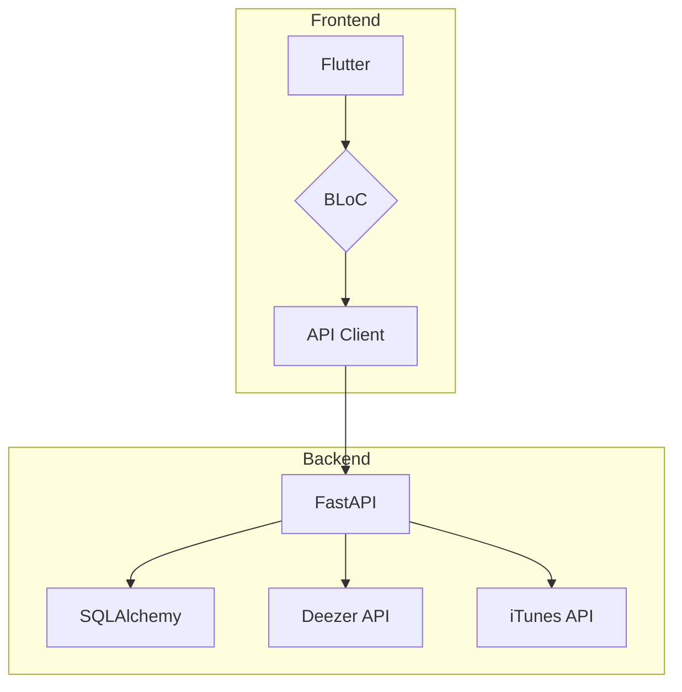

# Lyrics Guesser Mini Game

A fun and interactive mini-game that tests your knowledge of song lyrics.

## Description

This is a full-stack application with a Flutter frontend and a Python backend. The backend serves a RESTful API that provides song lyrics, and the frontend is a mobile application that allows users to play the game.

The game is simple: you are given a snippet of lyrics and you have to guess the song title and artist. The more you guess correctly, the higher your score.

## Tech Stack

### Backend

- **Python**: The core backend language.
- **FastAPI**: A modern, fast (high-performance) web framework for building APIs with Python 3.7+ based on standard Python type hints.
- **SQLAlchemy**: The SQL toolkit and Object Relational Mapper for Python.
- **Poetry**: A tool for dependency management and packaging in Python.
- **Deezer and iTunes APIs**: The backend seems to use these APIs to fetch song data.

#### Dependencies

- **fastapi**: >=0.128.0,<0.129.0
- **uvicorn**: >=0.40.0,<0.41.0
- **httpx**: >=0.28.1,<0.29.0
- **thefuzz**: >=0.22.1,<0.23.0
- **itsdangerous**: >=2.2.0,<3.0.0
- **python-multipart**: >=0.0.21,<0.0.22

### Frontend

- **Flutter**: Google's UI toolkit for building natively compiled applications for mobile, web, and desktop from a single codebase.
- **Dart**: The language used for Flutter development.
- **BLoC**: A predictable state management library for Dart.

#### Dependencies

- **flutter_bloc**: ^9.1.1
- **equatable**: ^2.0.5
- **dio**: ^5.9.0
- **google_fonts**: ^6.2.1

## Architecture Diagram

## Getting Started

### Prerequisites

- Flutter
- Python 3.7+
- Poetry

### Backend Setup

1.  Navigate to the `backend` directory.
2.  Install dependencies: `poetry install`
3.  Run the development server: `poetry run uvicorn app.main:app --reload`

### Frontend Setup

1.  Navigate to the `frontend` directory.
2.  Install dependencies: `flutter pub get`
3.  Run the app: `flutter run`

## Features

- Guess the song title and artist from a snippet of lyrics.
- Keep track of your score.
- Multiple game modes.

## Future Improvements

- Add more game modes.
- Add a leaderboard to compare scores with other players.
- Add user authentication and profiles.
- Improve the UI/UX.

## License

This project is licensed under the MIT License - see the [LICENSE](LICENSE) file for details.
